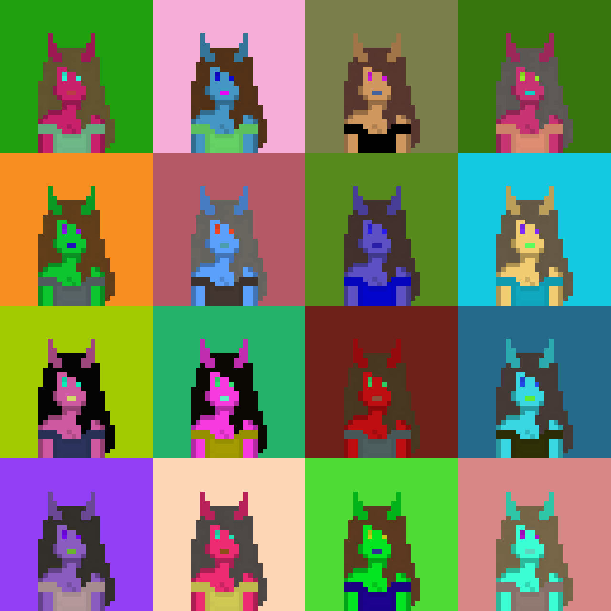

# python_depresseddemons
Fake NFT generator for a fake lineup named "Depressed Demons".

# Usage
Feel free to fork it and make whatever from it. The code can be used however you like, I wrote it in about 30 minutes and it is bad anyway.
Please do credit me if you use any of the sprites in your projects. A link to my GitHub (https://github.com/SeriousWeasle) or to here (https://github.com/SeriousWeasle/python_depresseddemons) is fine.

Usage for commercial applications is fine by me (games, art, etc.) ***but I don't allow you to use these images to make actual NFT's***. *It is meant as a parody and should stay that way.*

# Why does this exist?
I got bored and decided to make this atrocity.

# Preview

